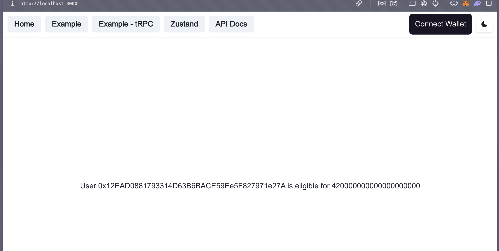
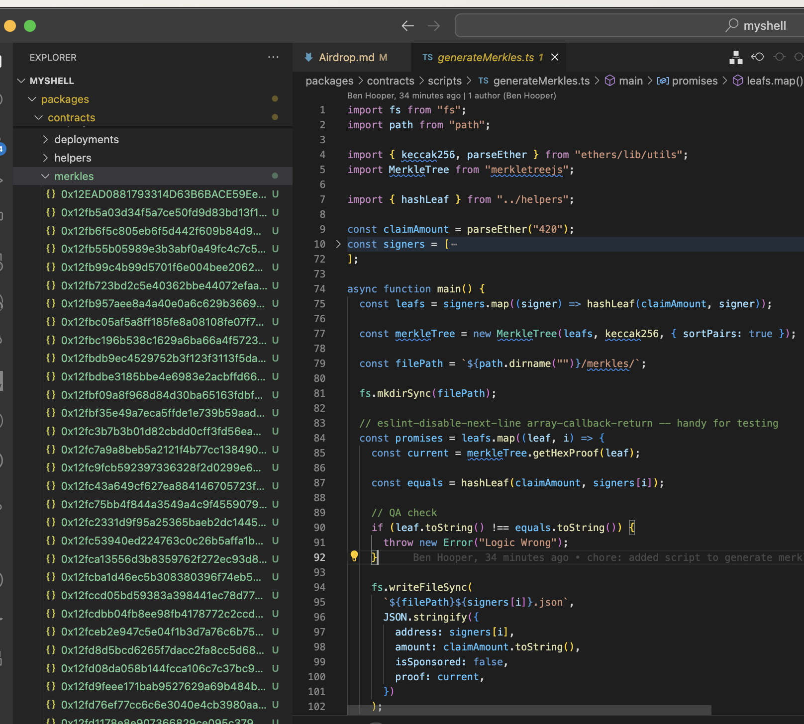

# Determining if a user has an airdrop quantity

In order for a user to claim their airdrop allocation, they need the proof of their existence of their record in the contracts merkle root.

The best way to do this is to pregenerate all of these proofs, and put them in endpoints that are easy to access.

I am in the process of finalising this process to generate all these proofs most efficiently, but here's an example of what the finished system will look like.

Say for example, we have a user with wallet address `0x12EAD0881793314D63B6BACE59Ee5F827971e27A`. In order to check if this user is eligible for an airdrop amount, all we need to do is send a GET request to some endpoint:

`${NEXT_PUBLIC_AIRDROP_LIST_URL}/0x12EAD0881793314D63B6BACE59Ee5F827971e27A.json`

If this GET request returns a 200 - we'll get something that looks like this:

```js
{
  "address": "0x12EAD0881793314D63B6BACE59Ee5F827971e27A",
  "amount": "420000000000000000000",
  "isSponsored": false,
  "proof": [
    "0xa6e2773e1ee25e5b0a1c190775bd9713f4267b361b1000a84d8b8eb1e50626a3",
    "0x316112edc3e07129fc6c04c1e9406d5efc28845485758c437cf1bbe651d9647d",
    "0xe4dea11e449f42d118c653b4ab3483a4403b9397b120f4eed69beafe53aae2cc",
    "0xb65100eee5963ca3376291ceb618076cd3ce80fbbbe32c4651a5f8e970927a91",
    "0xea0e6142551cc65039eedb24d0727281632c323263bb6e3c65c7297ed41a7743",
    "0x9eecd1ac41965d4000d50ca774116fe2b4c2c1c927b13bfd9ceb7bd6d54b88ab"
  ]
}
```

From here - we have all the info we need for this given user.

Here's an example of how you could build the eligibility screen (please go easy on my front end'ing skills - it's been a while):

```jsx
interface AirdropData {
  address: string;
  amount: string;
  proof: string[];
  isSponsored: boolean;
}

const HomePage: NextPage = () => {
  // just a useSate here - this could ideally be in zustand?
  const [airdropData, setAirdropData] = useState<AirdropData>();

  const getAirdropDetails = async () => {
    // here I am using a static address, but in the real implementation, will use thirdweb
    // to get that address field, or a form input for the eligibility screen
    const address = "0x12EAD0881793314D63B6BACE59Ee5F827971e27A";

    // I have just put my 'merkles' merkle proofs folder into the next app's public folder for testing
    const { data } = (await axios.get(`/merkles/${address}.json`)) as {
      data: AirdropData;
    };

    setAirdropData(data);
  };

  // this + the airdropData should make use of a useQuery, but I can't currently access GPT to
  // get it to do that for me lol whoopsie
  useEffect(() => {
    getAirdropDetails();
  }, []);

  return (
    <Flex
      p="20px"
      justifyContent="center"
      alignItems="center"
      h="100vh"
      flexDirection="column"
    >
      {airdropData ? (
        <Flex>
          <Text>
            User {airdropData.address} is eligible for {airdropData.amount}
          </Text>
        </Flex>
      ) : (
        <Flex>
          <Text>Sorry 😢 none for you</Text>
        </Flex>
      )}
    </Flex>
  );
};
```

which looks ike this on the front end:



So Chani, to test this on your own front end, here's what I'd do:

- populate your `app/client/public/merkles/` folder with an example file like the one above, but named after your wallet address (or any others for the eligibility look up)

If you need to, you can generate a merkles folder programmatically with the script I've been using, if you run:

```
cd packages/contracts
npx hardhat run scripts/generateMerkles.ts
```

this will write all merkle proofs to `packages/contracts/merkles`, and you can copy paste this straight into your `app/client/public/` to then use in code similar to my example above:



(you would just add your address to the signers array on line 10)
